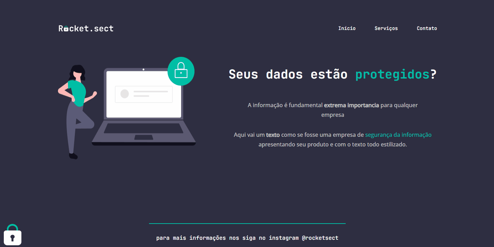

    <h1>Desafio final - Semana 2 </h1>

 

# Sobre o desafio

 Desafio concluido - Foi recebido um layout no Figma para que fosse transformado em código 

 

# Resolução do problema

* Código foi criado a partir de um layout do figma respeitando todas as suas especificações

# Features 
- [x]  Layout do Desafio final da segunda semana do Programa Explorer

 

# DEMO 

<h1 align="center">
    
</h1>